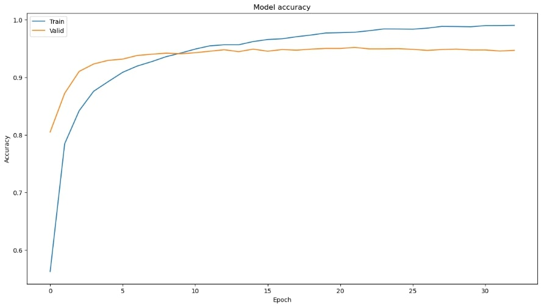
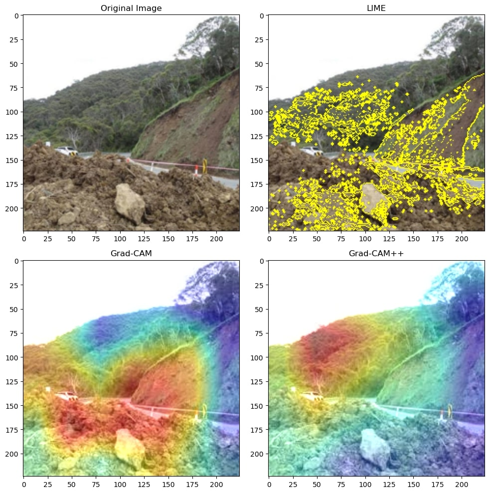
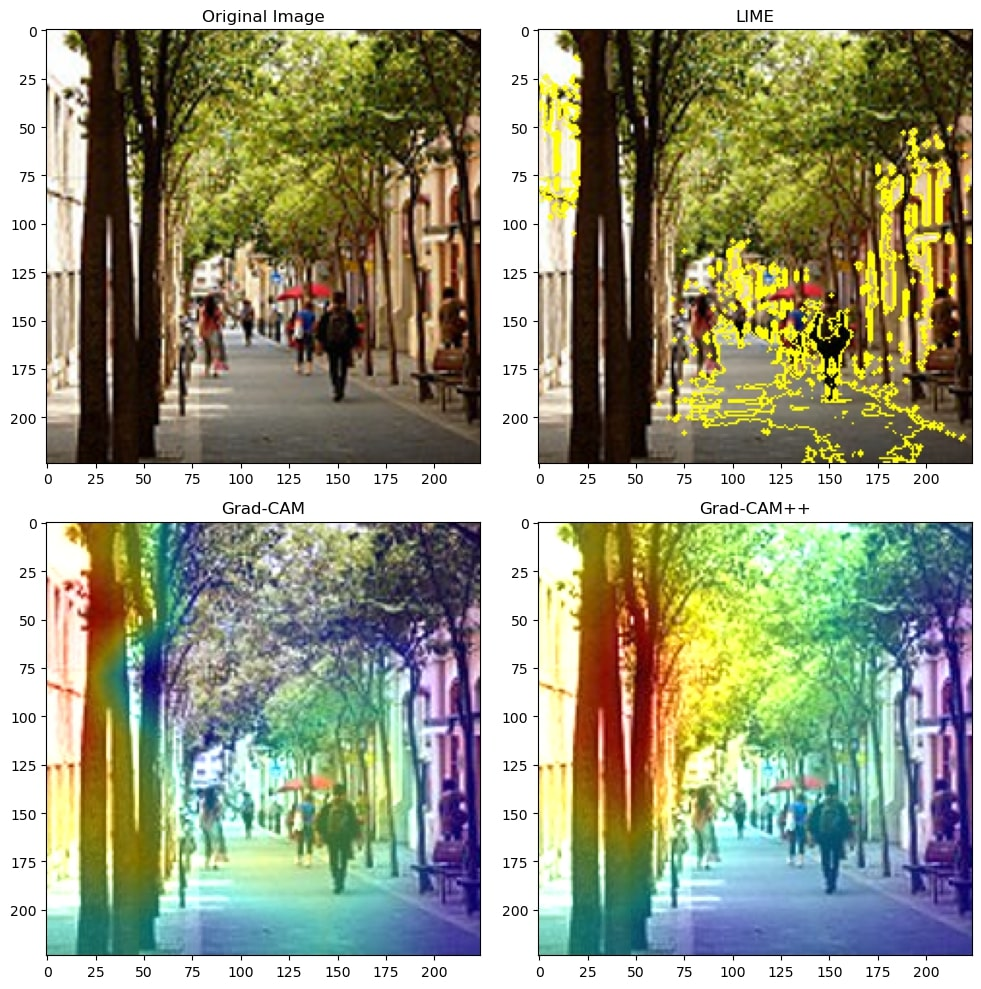

Conducting Explainable AI (XAI) on Disasters Image Classification Model Augmented with  Pretrained CNN
==============================
This is a submission of **final paper** for the **CIS726** course.

It contains the code necessary to implement a CNN model concerning disasters while including XAI visualization for
selected images.

The dataset from the [Disaster Classification](https://www.kaggle.com/code/teresadl/disaster-classification) has been
used.

Collaborators 🥇
------------

* Tariq Sha'ban
* Rand Agha
* Lujain Ghazalat

Getting Started
------------
Clone the project from GitHub

`$ git clone https://github.com/tariqshaban/disaster-classification-with-xai.git`

No further configuration is required.

Usage
------------
Simply run the notebook on any IPython distro.

Methodology
------------
The main operations conducted in this repository are thus:

* Modify the `global variables` section:
    * Epochs
    * Learning rate:
        * 0.1
        * 0.01
        * 0.001
    * Pretrained model (base model)
        * ResNet50
        * InceptionV3
        * VGG19
    * Preprocessing method (in concurrence with the pretrained model)
    * Optimization algorithm:
        * Root Mean Squared Propagation (RMSProp)
        * Adam, a replacement for stochastic gradient descent
    * EPOCHS
* Read and decode the dataset into an array of pairs, denoting the true label of the image and the image name itself.
* Randomly partitioning the dataset into training, validation, and test (70% 20% 10%).
* Build a CNN model with the following characteristics:
    * **Hyperparameters**:
        * Epochs: 50
        * Learning rate: 0.01
    * **Layers**:
        * The selected base model
        * Identity: since directly accessing the base model for the Grad-CAM is not possible
        * GlobalAveragePooling2D
        * Dropout: 50%
        * Softmax activation function
* Plotting the model's performance:
    * Training accuracy
    * Validation accuracy
    * Training loss
    * Validation loss
    * Validation loss
    * Testing confusion matrix (applicable since the model is for multi-label classification)
* Visualize image samples :
    * Display original image
    * Display image augmented with LIME explainer
    * Display image augmented with Grad-CAM explainer
    * Display image augmented with Grad-CAM++ explainer
* Modify the global variables based on the observed results.

Findings
------------

<table>
<thead>
  <tr>
    <th colspan="2"></th>
    <th colspan="2">Learning Rate of 0.1</th>
    <th colspan="2">Learning Rate of 0.01</th>
    <th colspan="2">Learning Rate of 0.001</th>
  </tr>
  <tr>
    <th>Pretrained model</th>
    <th>Optimizer</th>
    <th>Accuracy</th>
    <th>Loss</th>
    <th>Accuracy</th>
    <th>Loss</th>
    <th>Accuracy</th>
    <th>Loss</th>
  </tr>
</thead>
<tbody>
  <tr>
    <th rowspan="2">ResNet50</th>
    <th>RMSProp</th>
    <td>%92.81</td>
    <td>4.8205</td>
    <td>%90.41</td>
    <td>0.7413</td>
    <td>%94.24</td>
    <td>0.1648</td>
  </tr>
  <tr>
    <th>Adam</th>
    <td>%89.45</td>
    <td>6.3463</td>
    <td>%92.57</td>
    <td>0.4252</td>
    <td>&#9989; %95.68</td>
    <td>&#9989; 0.1455</td>
  </tr>
  <tr>
    <th rowspan="2">InceptionV3</th>
    <th>RMSProp</th>
    <td>%86.57</td>
    <td>7.7356</td>
    <td>%83.45</td>
    <td>1.1538</td>
    <td>%93.05</td>
    <td>0.2375</td>
  </tr>
  <tr>
    <th>Adam</th>
    <td>%88.73</td>
    <td>8.2804</td>
    <td>%91.61</td>
    <td>0.5801</td>
    <td>%92.81</td>
    <td>0.2396</td>
  </tr>
  <tr>
    <th rowspan="2">VGG19</th>
    <th>RMSProp</th>
    <td>%82.73</td>
    <td>7.0969</td>
    <td>%80.82</td>
    <td>1.0777</td>
    <td>%89.93</td>
    <td>0.3247</td>
  </tr>
  <tr>
    <th>Adam</th>
    <td>%76.74</td>
    <td>12.5101</td>
    <td>%87.29</td>
    <td>0.8974</td>
    <td>%89.69</td>
    <td>0.2934</td>
  </tr>
</tbody>
</table>

> Based on the table, ResNet50 with Adam optimizer and a learning rate of 0.001 returned the best results.

> ### Model Performance
>
> The following images are the result of using ResNet50 with RMSProp optimizer on 0.01 learning rate on a different
> runtime than the table
>
> 
>
> Note that the model reached %96 on accuracy, compared to %90.41 in the table, this proves that deep learning models
> results vary in different runs.
>
> 
>
> Similarly, the model was able to reach 0.2 in loss, compared to 0.74 in the table
>
> 
>
> Regardless of the hyperparameters enforced, all models generally have a relatively higher error rate in distinguishing
> between
> urban fire and wildfire, as well as between infrastructure damage and landslide, such observed behaviour seems
> logical; due to the shared characteristics between these classes.
>
> --------
>
> ### XAI Results
>
> The following are the XAI interpretation on random image samples, either from the dataset itself, or from external
> sources.
>
> 
> 
> 
> 
> 
> 
> 
> 
> 
>
> All the images has been successfully classified to their true label.

Notes
------------

* Deep learning algorithms may tend to have slightly different results, even when fixating hyperparameters and
  conditions; due to randomness properties of the initial weights.
* For unknown reasons, some images did produce a valid interpretable images on both Grad-CAM and Grad-CAM++
* It appears that some of the provided true labels of the images are incorrect. A fair amount of images are not refined,
  that is, some images contain banners or even watermarks that might hinder the model’s performance.

--------