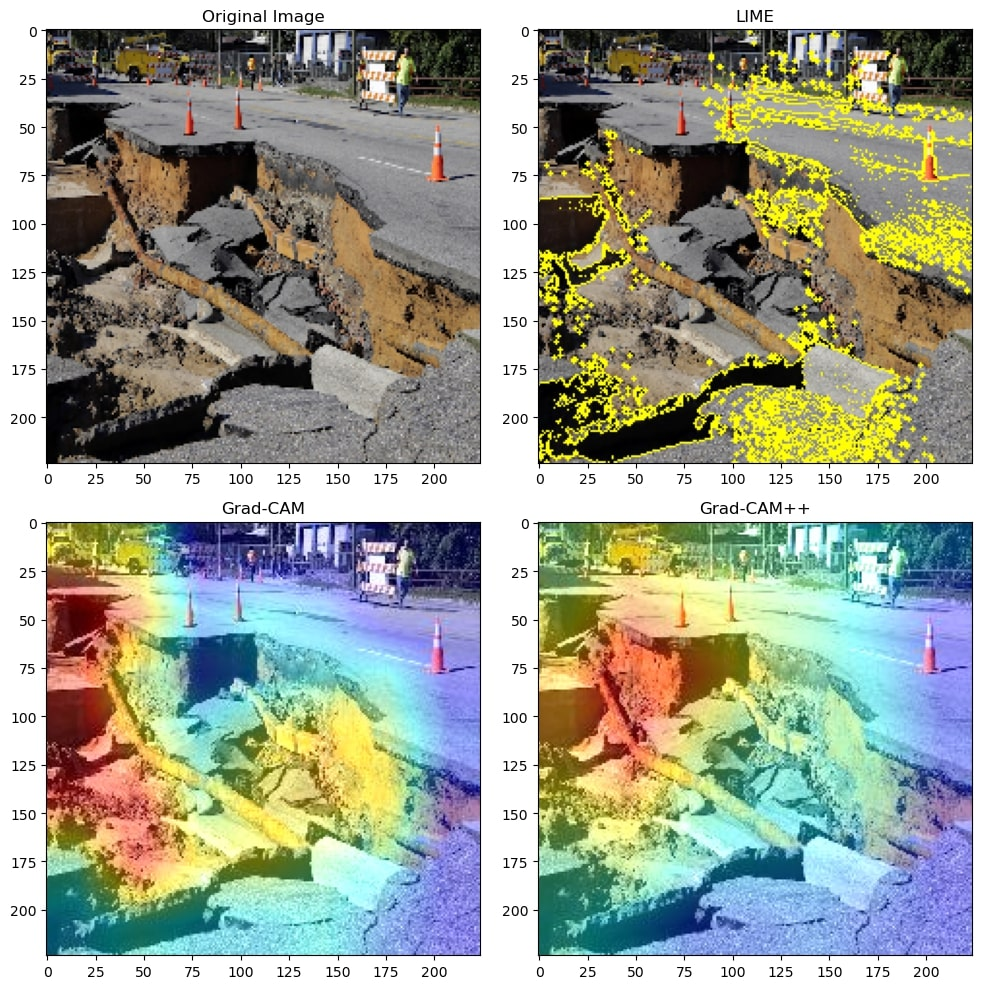
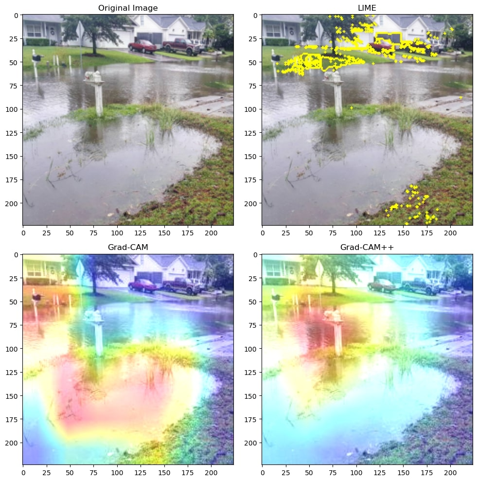

Conducting Explainable AI (XAI) on Disasters Image Classification Model Augmented with Pretrained CNN
==============================
This is a submission of **final paper** for the **CIS726** course.

It contains the code necessary to implement a CNN model concerning disasters while including XAI visualization for
selected images.

The dataset from the [Disaster Image Classification](https://www.kaggle.com/datasets/varpit94/disaster-images-dataset)
and [MEDIC](https://github.com/firojalam/medic/) has been used.


Collaborators 🥇
------------

* Tariq Sha'ban
* Rand Agha
* Lujain Ghazalat

Getting Started
------------
Clone the project from GitHub

`$ git clone https://github.com/tariqshaban/disaster-classification-with-xai.git`

TensorFlow with Keras needs to be installed (preferably utilizing GPU acceleration "CUDA-enabled")

No further configuration is required.


Usage
------------
Simply run the notebook on any IPython program.


Methodology
------------
The main operations conducted in this repository are thus:

* Modify the `global variables` section:
    * Generic seed
    * Epochs
    * Learning rate:
        * 0.01
        * 0.001
        * 0.0001
    * Pretrained model (base model)
        * ResNet50
        * InceptionV3
        * VGG19
        * EfficientNetB0
        * EfficientNetB7
        * EfficientNetV2B0
        * EfficientNetV2L
        * ViT-B-32
    * Preprocessing method (in concurrence with the pretrained model)
    * Optimization algorithm:
        * Root Mean Squared Propagation (RMSProp)
        * Adam, a replacement for stochastic gradient descent
* Read and decode the dataset into an array of pairs, denoting the true label of the image and the image name itself.
* Randomly partitioning the dataset into training, validation, and test (70% 20% 10%).
* Build a CNN model with the following characteristics:
    * **Hyperparameters**:
        * The specified number of epochs
        * The specified learning rate
        * The specified optimizer
    * **Layers**:
        * The selected base model
        * Identity layer; since directly accessing the base model for the Grad-CAM is not possible (Non-ViT models only)
        * GlobalAveragePooling2D layer (Non-ViT models only)
        * Multiple dropout layers: 20%
        * Rescaling layer: Part of the images' preprocessing (ViT models only)
        * Multiple dense layers with softmax activation function
* Plotting the model's performance:
    * Training accuracy
    * Validation accuracy
    * Training loss
    * Validation loss
    * Testing confusion matrix (applicable since the model is for multi-label classification)
* Visualize image samples:
    * Display the original image
    * Display the image augmented with LIME explainer
    * Display the image augmented with Grad-CAM explainer (Non-ViT models only)
    * Display the image augmented with Grad-CAM++ explainer (Non-ViT models only)
* Modify the global variables based on the observed results.

> **Note**: Classical machine learning classifiers are added to assess the effectiveness of the deep learning models;
> however, they are not fitted with XAI. Such machine learning models include:
> * Bagging
> * Decision tree
> * Random forest
> * K-nearest neighbors
> * SVM
> * Linear SVM (with SGD training)
> * Logistic regression (with SGD training)
>
> **HOG** (Histogram of Oriented Gradients) was used as a feature descriptor to extract the edge orientation of the
> images. Then, the result was flattened to be trained by these models.

The following methods should be invoked to build and evaluate the model, as well as to implement XAI techniques:

``` python
# Download and filter the dataset
load_dataset()

# Ready the dataset and partition it into training, validation, and testing
prime_dataset()

# Build the model, and optionally plot performance measurements
model = build_model(measure_performance=True)
```

``` python
# Fetches a single image via a specified URL in the form of a matrix as a nested list
img = url_to_image('https://maverickraylaw.com/wp-content/uploads/2021/10/shutterstock_1143680258-1.jpg')

# Conduct XAI methods for an image on a predefined model; XAI methods include LIME, Grad-CAM, and Grad-CAM++
plot_XAI(img, model)

# Predict the image's class based on a predefined model
predict_image_class(img, model)
```

``` python
# Fetches a single image directly from the dataset in the form of a matrix as a nested list
img = path_to_image('05_01_1225.png')

# Conduct XAI methods for an image on a predefined model; XAI methods include LIME, Grad-CAM, and Grad-CAM++
plot_XAI(img, model)

# Predict the image's class based on a predefined model
predict_image_class(img, model)
```

Findings
------------

<table>
<thead>
  <tr>
    <th>Machine Learning Model</th>
    <th>Disaster Image Classification Dataset</th>
    <th>MEDIC Dataset</th>
  </tr>
</thead>
<tbody>
  <tr>
    <th>Bagging</th>
    <td>%61.83</td>
    <td>%43.22</td>
  </tr>
  <tr>
    <th>Decision Tree</th>
    <td>%44.98</td>
    <td>%33.55</td>
  </tr>
  <tr>
    <th>Random Forest</th>
    <td>%64.10</td>
    <td>%46.02</td>
  </tr>
  <tr>
    <th>K-Nearest Neighbors</th>
    <td>%35.67</td>
    <td>%41.86</td>
  </tr>
  <tr>
    <th>SVM</th>
    <td>&#9989; %72.52</td>
    <td>&#9989; %54.46</td>
  </tr>
  <tr>
    <th>Linear SVM (with SGD training)</th>
    <td>%66.08</td>
    <td>%43.66</td>
  </tr>
  <tr>
    <th>Logistic Regression (with SGD training)</th>
    <td>%65.49</td>
    <td>%43.27</td>
  </tr>
</tbody>
</table>

<table>
<thead>
  <tr>
    <th colspan="2">Disaster Image Classification Dataset</th>
    <th colspan="2">Learning Rate of 0.01</th>
    <th colspan="2">Learning Rate of 0.001</th>
    <th colspan="2">Learning Rate of 0.0001</th>
  </tr>
  <tr>
    <th>Pretrained model</th>
    <th>Optimizer</th>
    <th>Accuracy</th>
    <th>Loss</th>
    <th>Accuracy</th>
    <th>Loss</th>
    <th>Accuracy</th>
    <th>Loss</th>
  </tr>
</thead>
<tbody>
  <tr>
    <th rowspan="2">ResNet50</th>
    <th>RMSProp</th>
    <td>%91.86</td>
    <td>0.4534</td>
    <td>%94.13</td>
    <td>0.3170</td>
    <td>%94.43</td>
    <td>0.2185</td>
  </tr>
  <tr>
    <th>Adam</th>
    <td>%90.40</td>
    <td>0.5933</td>
    <td>%94.43</td>
    <td>0.3208</td>
    <td>%94.65</td>
    <td>0.1973</td>
  </tr>
  <tr>
    <th rowspan="2">InceptionV3</th>
    <th>RMSProp</th>
    <td>%85.64</td>
    <td>0.4963</td>
    <td>%90.76</td>
    <td>0.3915</td>
    <td>%91.94</td>
    <td>0.3172</td>
  </tr>
  <tr>
    <th>Adam</th>
    <td>%65.01</td>
    <td>0.8476</td>
    <td>%90.25</td>
    <td>0.4804</td>
    <td>%90.98</td>
    <td>0.3253</td>
  </tr>
  <tr>
    <th rowspan="2">VGG19</th>
    <th>RMSProp</th>
    <td>%90.98</td>
    <td>0.5177</td>
    <td>%92.45</td>
    <td>0.2995</td>
    <td>%93.18</td>
    <td>0.3274</td>
  </tr>
  <tr>
    <th>Adam</th>
    <td>%91.13</td>
    <td>0.5561</td>
    <td>%92.60</td>
    <td>0.3322</td>
    <td>%92.67</td>
    <td>0.2999</td>
  </tr>
  <tr>
    <th rowspan="2">EfficientNetB0</th>
    <th>RMSProp</th>
    <td>%93.99</td>
    <td>0.5230</td>
    <td>%93.99</td>
    <td>0.3112</td>
    <td>%94.43</td>
    <td>0.2093</td>
  </tr>
  <tr>
    <th>Adam</th>
    <td>%93.55</td>
    <td>0.4254</td>
    <td>%93.99</td>
    <td>0.3295</td>
    <td>%94.21</td>
    <td>0.2096</td>
  </tr>
  <tr>
    <th rowspan="2">EfficientNetB7</th>
    <th>RMSProp</th>
    <td>%92.08</td>
    <td>0.7207</td>
    <td>%92.52</td>
    <td>0.4363</td>
    <td>%93.04</td>
    <td>0.3009</td>
  </tr>
  <tr>
    <th>Adam</th>
    <td>%91.50</td>
    <td>0.6972</td>
    <td>%92.45</td>
    <td>0.4202</td>
    <td>%92.96</td>
    <td>0.2996</td>
  </tr>
  <tr>
    <th rowspan="2">EfficientNetV2B0</th>
    <th>RMSProp</th>
    <td>%95.09</td>
    <td>0.4872</td>
    <td>%94.87</td>
    <td>0.2668</td>
    <td>%95.16</td>
    <td>0.1838</td>
  </tr>
  <tr>
    <th>Adam</th>
    <td>%94.13</td>
    <td>0.5253</td>
    <td>%94.57</td>
    <td>0.2977</td>
    <td>%95.16</td>
    <td>&#9989; 0.1834</td>
  </tr>
  <tr>
    <th rowspan="2">EfficientNetV2L</th>
    <th>RMSProp</th>
    <td>%91.72</td>
    <td>0.4893</td>
    <td>%92.45</td>
    <td>0.3260</td>
    <td>%93.62</td>
    <td>0.2588</td>
  </tr>
  <tr>
    <th>Adam</th>
    <td>%91.50</td>
    <td>0.5071</td>
    <td>%92.23</td>
    <td>0.3382</td>
    <td>%93.11</td>
    <td>0.2658</td>
  </tr>
  <tr>
    <th rowspan="2">ViT-B-32</th>
    <th>RMSProp</th>
    <td>%93.84</td>
    <td>1.3044</td>
    <td>%95.01</td>
    <td>0.5274</td>
    <td>&#9989; %95.23</td>
    <td>0.2551</td>
  </tr>
  <tr>
    <th>Adam</th>
    <td>%94.21</td>
    <td>1.1693</td>
    <td>%94.21</td>
    <td>0.5438</td>
    <td>%95.09</td>
    <td>0.2557</td>
  </tr>
</tbody>
</table>

<table>
<thead>
  <tr>
    <th colspan="2">MEDIC Dataset</th>
    <th colspan="2">Learning Rate of 0.01</th>
    <th colspan="2">Learning Rate of 0.001</th>
    <th colspan="2">Learning Rate of 0.0001</th>
  </tr>
  <tr>
    <th>Pretrained model</th>
    <th>Optimizer</th>
    <th>Accuracy</th>
    <th>Loss</th>
    <th>Accuracy</th>
    <th>Loss</th>
    <th>Accuracy</th>
    <th>Loss</th>
  </tr>
</thead>
<tbody>
  <tr>
    <th rowspan="2">ResNet50</th>
    <th>RMSProp</th>
    <td>%69.77</td>
    <td>0.9564</td>
    <td>%74.99</td>
    <td>0.8523</td>
    <td>%75.17</td>
    <td>0.7892</td>
  </tr>
  <tr>
    <th>Adam</th>
    <td>%71.79</td>
    <td>0.9097</td>
    <td>%74.57</td>
    <td>0.8770</td>
    <td>%74.99</td>
    <td>0.7892</td>
  </tr>
  <tr>
    <th rowspan="2">InceptionV3</th>
    <th>RMSProp</th>
    <td>%56.90</td>
    <td>1.2042</td>
    <td>%69.14</td>
    <td>1.0372</td>
    <td>%71.76</td>
    <td>0.8921</td>
  </tr>
  <tr>
    <th>Adam</th>
    <td>%66.00</td>
    <td>1.1068</td>
    <td>%71.29</td>
    <td>0.9361</td>
    <td>%71.87</td>
    <td>0.7187</td>
  </tr>
  <tr>
    <th rowspan="2">VGG19</th>
    <th>RMSProp</th>
    <td>%70.79</td>
    <td>1.0027</td>
    <td>%73.10</td>
    <td>0.8454</td>
    <td>%74.99</td>
    <td>0.7925</td>
  </tr>
  <tr>
    <th>Adam</th>
    <td>%71.06</td>
    <td>0.9752</td>
    <td>%72.26</td>
    <td>0.8487</td>
    <td>%74.41</td>
    <td>0.7893</td>
  </tr>
  <tr>
    <th rowspan="2">EfficientNetB0</th>
    <th>RMSProp</th>
    <td>%74.62</td>
    <td>0.8699</td>
    <td>%75.72</td>
    <td>0.8556</td>
    <td>%76.82</td>
    <td>0.7424</td>
  </tr>
  <tr>
    <th>Adam</th>
    <td>%73.81</td>
    <td>0.8858</td>
    <td>%75.64</td>
    <td>0.8607</td>
    <td>%76.51</td>
    <td>0.7434</td>
  </tr>
  <tr>
    <th rowspan="2">EfficientNetB7</th>
    <th>RMSProp</th>
    <td>%71.45</td>
    <td>0.9280</td>
    <td>%74.04</td>
    <td>0.9616</td>
    <td>%75.36</td>
    <td>0.7886</td>
  </tr>
  <tr>
    <th>Adam</th>
    <td>%72.84</td>
    <td>0.9325</td>
    <td>%73.78</td>
    <td>0.9565</td>
    <td>%75.36</td>
    <td>0.7891</td>
  </tr>
  <tr>
    <th rowspan="2">EfficientNetV2B0</th>
    <th>RMSProp</th>
    <td>%72.26</td>
    <td>0.8460</td>
    <td>%76.46</td>
    <td>0.8137</td>
    <td>%77.06</td>
    <td>0.7157</td>
  </tr>
  <tr>
    <th>Adam</th>
    <td>%75.15</td>
    <td>0.8510</td>
    <td>%76.38</td>
    <td>0.7877</td>
    <td>%77.22</td>
    <td>&#9989; 0.7140</td>
  </tr>
  <tr>
    <th rowspan="2">EfficientNetV2L</th>
    <th>RMSProp</th>
    <td>%73.68</td>
    <td>0.8792</td>
    <td>%74.65</td>
    <td>0.8268</td>
    <td>%75.88</td>
    <td>0.7582</td>
  </tr>
  <tr>
    <th>Adam</th>
    <td>%72.94</td>
    <td>0.9182</td>
    <td>%75.15</td>
    <td>0.8221</td>
    <td>%75.93</td>
    <td>0.7572</td>
  </tr>
  <tr>
    <th rowspan="2">ViT-B-32</th>
    <th>RMSProp</th>
    <td>%73.78</td>
    <td>1.2433</td>
    <td>%76.43</td>
    <td>1.5416</td>
    <td>&#9989; %76.93</td>
    <td>0.8988</td>
  </tr>
  <tr>
    <th>Adam</th>
    <td>%74.83</td>
    <td>1.4110</td>
    <td>%76.27</td>
    <td>1.7522</td>
    <td>%76.85</td>
    <td>0.9353</td>
  </tr>
</tbody>
</table>

> Based on the table, ViT-B-32 (RMSProp) at a learning rate of 0.0001 returned the highest accuracy, while
> EfficientNetV2B0 (Adam) at a learning rate of 0.0001 returned the lowest loss.

> ### Model Performance
>
> The following images are the result of using ViT-B-32 with RMSProp optimizer on 0.0001 learning rate (for the
> **Disaster Image Classification Dataset**).
>
> 
> 
>
> Note that the model started converging at the 8th epoch since the pretrained model's weight has expedited the
> learning process.
>
> 
>
> Regardless of the hyperparameters enforced, all models generally have a relatively higher error rate in distinguishing
> between urban fire and wildfire, as well as between infrastructure damage and landslide, such observed behaviour seems
> logical; due to the shared characteristics between these classes.
>
> --------
>
> ### XAI Results
>
> The following are the XAI interpretation on random image samples, either from the dataset itself, or from external
> sources.
> 
> ResNet50 has been used for the XAI instead of the best model (ViT-B-32); since Grad-CAM and Grad-CAM++ require a 2D 
> layer; which is only available in the pretrained CNN models.
>
> 
> 
> 
> 
> 
> 
> 
> 
> 
>
> All the images have been successfully classified to their true label.

Notes
------------

* It appears that some of the provided true labels of the images are incorrect. A fair amount of images is not refined,
  that is, some images contain banners or even watermarks that might hinder the model’s performance.

--------