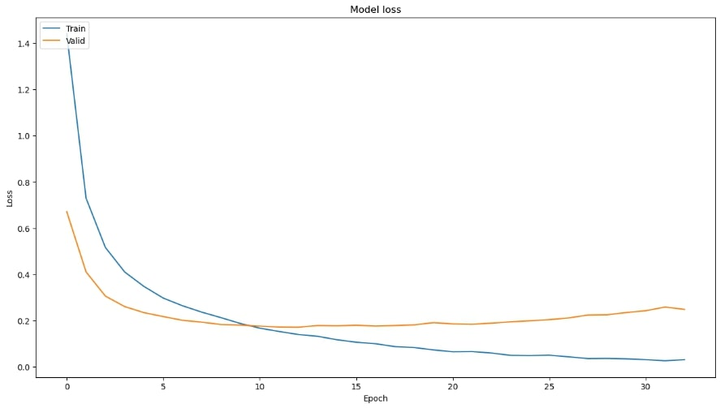
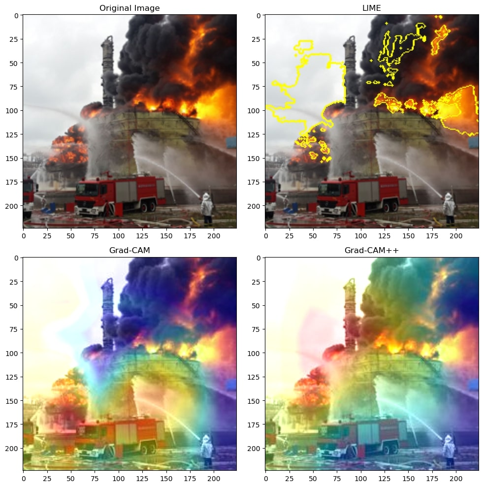
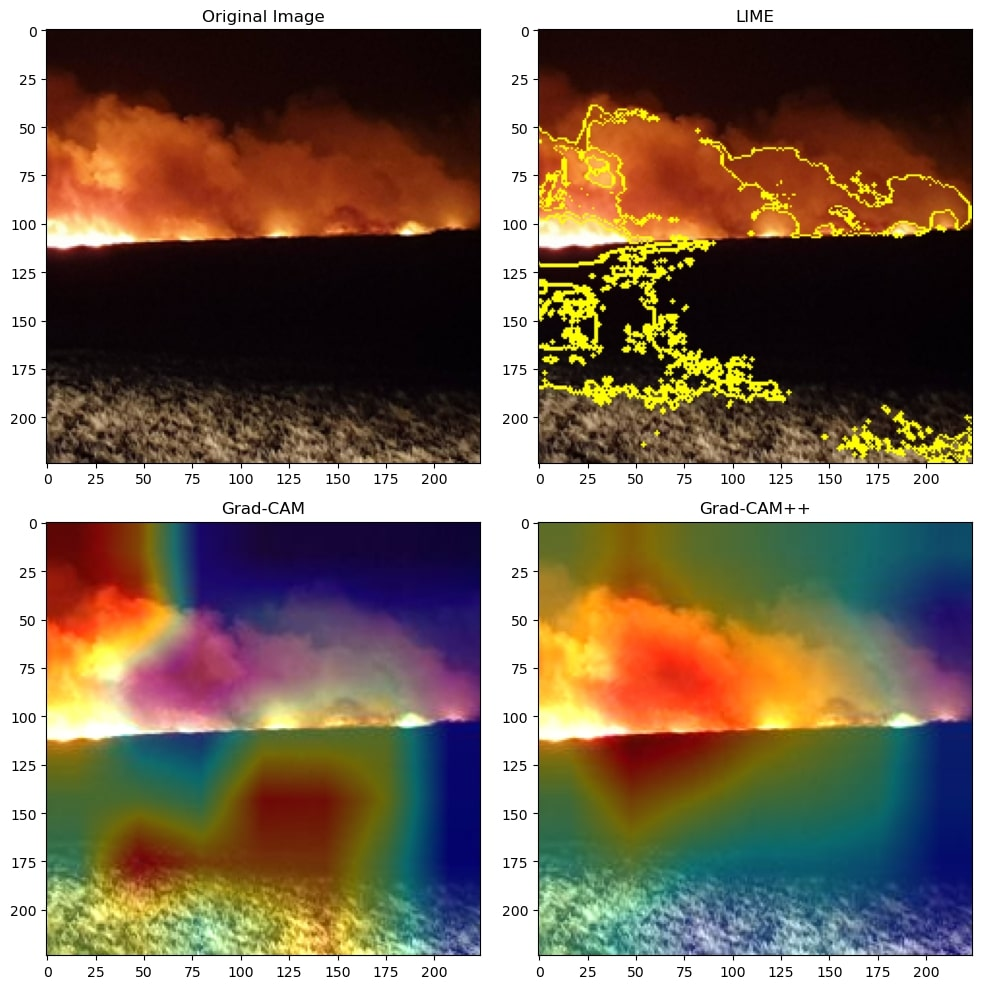

Conducting Explainable AI (XAI) on Disasters Image Classification Model Augmented with  Pretrained CNN
==============================
This is a submission of **final paper** for the **CIS726** course.

It contains the code necessary to implement a CNN model concerning disasters while including XAI visualization for
selected images.

The dataset from the [Disaster Classification](https://www.kaggle.com/code/teresadl/disaster-classification) has been
used.


Collaborators 🥇
------------

* Tariq Sha'ban
* Rand Agha
* Lujain Ghazalat

Getting Started
------------
Clone the project from GitHub

`$ git clone https://github.com/tariqshaban/disaster-classification-with-xai.git`

No further configuration is required.


Usage
------------
Simply run the notebook on any IPython distro.


Methodology
------------
The main operations conducted in this repository are thus:

* Modify the `global variables` section:
    * Generic Seed
    * Epochs
    * Learning rate:
        * 0.1
        * 0.01
        * 0.001
    * Pretrained model (base model)
        * ResNet50
        * InceptionV3
        * VGG19
        * EfficientNetB0
        * EfficientNetB7
        * EfficientNetV2B0
        * EfficientNetV2L
    * Preprocessing method (in concurrence with the pretrained model)
    * Optimization algorithm:
        * Root Mean Squared Propagation (RMSProp)
        * Adam, a replacement for stochastic gradient descent
    * EPOCHS
* Read and decode the dataset into an array of pairs, denoting the true label of the image and the image name itself.
* Randomly partitioning the dataset into training, validation, and test (70% 20% 10%).
* Build a CNN model with the following characteristics:
    * **Hyperparameters**:
        * The specified number of epochs
        * The specified learning rate
        * The specified optimizer
    * **Layers**:
        * The selected base model
        * Identity: since directly accessing the base model for the Grad-CAM is not possible
        * GlobalAveragePooling2D
        * Dropout: 50%
        * Softmax activation function
* Plotting the model's performance:
    * Training accuracy
    * Validation accuracy
    * Training loss
    * Validation loss
    * Testing confusion matrix (applicable since the model is for multi-label classification)
* Visualize image samples :
    * Display original image
    * Display image augmented with LIME explainer
    * Display image augmented with Grad-CAM explainer
    * Display image augmented with Grad-CAM++ explainer
* Modify the global variables based on the observed results.

The following methods should be invoked to build and evaluate the model, as well as to implement XAI techniques:

``` python
# Ready the dataset and partition it to training, validation, and testing
prime_dataset()

# Build the model, and optionally plot performance measurements
model = build_model(measure_performance=True)
```

``` python
# Fetches a single image via a specified URL in a form of the matrix as a nested list
img = url_to_image('https://maverickraylaw.com/wp-content/uploads/2021/10/shutterstock_1143680258-1.jpg')

# Conduct XAI methods for an image on a predefined model; XAI methods include LIME, Grad-CAM, and Grad-CAM++
plot_XAI(img, model)

# Predict the image's class based on a predefined model
predict_image_class(img, model)
```

``` python
# Fetches a single image directly from the dataset in the form of a matrix as a nested list
img = path_to_image('05_01_1225.png')

# Conduct XAI methods for an image on a predefined model; XAI methods include LIME, Grad-CAM, and Grad-CAM++
plot_XAI(img, model)

# Predict the image's class based on a predefined model
predict_image_class(img, model)
```

Findings
------------

<table>
<thead>
  <tr>
    <th colspan="2"></th>
    <th colspan="2">Learning Rate of 0.1</th>
    <th colspan="2">Learning Rate of 0.01</th>
    <th colspan="2">Learning Rate of 0.001</th>
  </tr>
  <tr>
    <th>Pretrained model</th>
    <th>Optimizer</th>
    <th>Accuracy</th>
    <th>Loss</th>
    <th>Accuracy</th>
    <th>Loss</th>
    <th>Accuracy</th>
    <th>Loss</th>
  </tr>
</thead>
<tbody>
  <tr>
    <th rowspan="2">ResNet50</th>
    <th>RMSProp</th>
    <td>%92.38</td>
    <td>7.1750</td>
    <td>%93.48</td>
    <td>0.7215</td>
    <td>&#9989; %95.16</td>
    <td>0.1901</td>
  </tr>
  <tr>
    <th>Adam</th>
    <td>%93.41</td>
    <td>6.8198</td>
    <td>%91.79</td>
    <td>0.8718</td>
    <td>&#9989; %95.16</td>
    <td>0.1901</td>
  </tr>
  <tr>
    <th rowspan="2">InceptionV3</th>
    <th>RMSProp</th>
    <td>%89.82</td>
    <td>7.3318</td>
    <td>%90.48</td>
    <td>0.8958</td>
    <td>%90.92</td>
    <td>0.2828</td>
  </tr>
  <tr>
    <th>Adam</th>
    <td>%86.37</td>
    <td>13.0176</td>
    <td>%87.91</td>
    <td>1.0381</td>
    <td>%90.92</td>
    <td>0.2828</td>
  </tr>
  <tr>
    <th rowspan="2">VGG19</th>
    <th>RMSProp</th>
    <td>%88.72</td>
    <td>10.3487</td>
    <td>%89.30</td>
    <td>0.9921</td>
    <td>%90.99</td>
    <td>0.3034</td>
  </tr>
  <tr>
    <th>Adam</th>
    <td>%87.91</td>
    <td>12.1033</td>
    <td>%88.94</td>
    <td>0.9679</td>
    <td>%90.99</td>
    <td>0.3034</td>
  </tr>
  <tr>
    <th rowspan="2">EfficientNetB0</th>
    <th>RMSProp</th>
    <td>%91.06</td>
    <td>2.7745</td>
    <td>%91.79</td>
    <td>0.3696</td>
    <td>%93.11</td>
    <td>0.2279</td>
  </tr>
  <tr>
    <th>Adam</th>
    <td>%90.55</td>
    <td>3.2243</td>
    <td>%91.79</td>
    <td>0.3696</td>
    <td>%93.11</td>
    <td>0.2279</td>
  </tr>
  <tr>
    <th rowspan="2">EfficientNetB7</th>
    <th>RMSProp</th>
    <td>%89.45</td>
    <td>3.3252</td>
    <td>%90.62</td>
    <td>0.4246</td>
    <td>%90.99</td>
    <td>0.2771</td>
  </tr>
  <tr>
    <th>Adam</th>
    <td>%89.45</td>
    <td>3.2520</td>
    <td>%90.62</td>
    <td>0.4246</td>
    <td>%90.99</td>
    <td>0.2771</td>
  </tr>
  <tr>
    <th rowspan="2">EfficientNetV2B0</th>
    <th>RMSProp</th>
    <td>%92.01</td>
    <td>2.3601</td>
    <td>%92.75</td>
    <td>0.3006</td>
    <td>%94.07</td>
    <td>&#9989; 0.1897</td>
  </tr>
  <tr>
    <th>Adam</th>
    <td>%92.82</td>
    <td>2.1001</td>
    <td>%92.75</td>
    <td>0.3006</td>
    <td>%94.07</td>
    <td>&#9989; 0.1897</td>
  </tr>
  <tr>
    <th rowspan="2">EfficientNetV2L</th>
    <th>RMSProp</th>
    <td>%91.28</td>
    <td>1.6932</td>
    <td>%90.62</td>
    <td>0.3512</td>
    <td>%91.79</td>
    <td>0.2696</td>
  </tr>
  <tr>
    <th>Adam</th>
    <td>%90.70</td>
    <td>1.9538</td>
    <td>%90.62</td>
    <td>0.3512</td>
    <td>%91.79</td>
    <td>0.2696</td>
  </tr>
</tbody>
</table>

> Based on the table, ResNet50 at a learning rate of 0.001 returned the best accuracy, while EfficientNetV2B0 at a
> learning rate of 0.001 returned the lowest loss, the optimization algorithm type did not seem to carry a significant
> contribution.

> ### Model Performance
>
> The following images are the result of using ResNet50 with Adam optimizer on 0.001 learning rate on a different
> runtime than the table
>
> 
>
> Note that the model reached %96 on accuracy, compared to %90.41 in the table, this proves that deep learning models
> results vary in different runs.
>
> 
>
> Similarly, the model was able to reach 0.2 in loss, compared to 0.74 in the table
>
> 
>
> Regardless of the hyperparameters enforced, all models generally have a relatively higher error rate in distinguishing
> between
> urban fire and wildfire, as well as between infrastructure damage and landslide, such observed behaviour seems
> logical; due to the shared characteristics between these classes.
>
> --------
>
> ### XAI Results
>
> The following are the XAI interpretation on random image samples, either from the dataset itself, or from external
> sources.
>
> 
> 
> 
> 
> 
> 
> 
> 
> 
>
> All the images has been successfully classified to their true label.

Notes
------------

* It appears that some of the provided true labels of the images are incorrect. A fair amount of images is not refined,
  that is, some images contain banners or even watermarks that might hinder the model’s performance.

--------